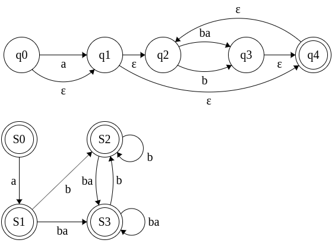

# Exercise 3.2

## Regex
Write a regular expression that recognizes all sequences consisting of a and b where two a’s are always separated by at least one b. For instance, these four strings are legal: b, a, ba, ababbbaba; but these two strings are illegal: aa, babaa.  

Solution:
```regexp
^(a?(ba|b)*)$
```

## NFA
Construct the corresponding NFA.

Solution:   


## DFA
Try to find a DFA corresponding to the NFA.

Solution:  
| State |  a  |  b  |  ba |    NFA States    |
|:-----:|:---:|:---:|:---:|:----------------:|
|   S0  |  S1 | Err | Err | {q0, q1, q2, q4} |
|   S1  | Err |  S2 |  S3 |   {q1, q2, q4}   |
|   S2  | Err |  S2 |  S3 |   {q2, q3, q4}   |
|   S3  | Err |  S2 |  S3 |   {q2, q3, q4}   |

