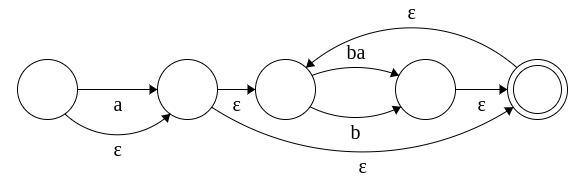

# Exercise 3.2

## Regex
Write a regular expression that recognizes all sequences consisting of a and b where two a’s are always separated by at least one b. For instance, these four strings are legal: b, a, ba, ababbbaba; but these two strings are illegal: aa, babaa.  

Solution:
```regexp
^(a?(ba|b)*)$
```

## NFA
Construct the corresponding NFA.

Solution:   
The program i used to draw the NFA did not support special characters, so the epsilon character is written in text.


## DFA