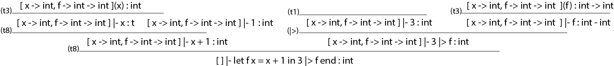

# 1 Regulære udtryk og automater

1)

2)

3)

4)

# 2 Icon

statement:
```fsharp
let examEx1 = Write(FromTo(1,6))
> run iconEx1;;
1 val it : value = Int 1
```
1) Skriv et Icon udtryk, som udskriver værdierne 1 2 3 4 5 6 på skærmen, fx.:
```fsharp
> run (Every(Write(FromTo(1,6))));;
1 2 3 4 5 6 val it : value = Int 0
```

2) Skriv et Icon udtryk, som udskriver følgende på skærmen: 33 34 43 44 53 54 63 64

```fsharp
//This is ugly as fuck
> run (Every(Write(Prim("+",Or(CstI(33),Or(CstI(43),Or(CstI(53),CstI(63)))),FromTo(0,1)))));;
33 34 43 44 53 54 63 64 val it : value = Int 0
```

3) Udvid implementationen af Icon med en ny generator FromToBy(s,e,i)

```fsharp
type expr = 
  | ...
  | FromToBy of int * int * int
  | ...
```

```fsharp
let rec eval (e : expr) (cont : cont) (econt : econt) = 
    match e with
    | ...
    | FromToBy(s,e,i) ->
      let rec loop n =
        if n <= e then
          cont (Int n) (fun () -> loop (n+i))
        else 
          econt ()
      loop s        
    | ...
```

```fsharp
> run (Every(Write(FromToBy(1, 10, 3))));;
1 4 7 10 val it : value = Int 0
```

4) Skriv en udgave af dit svar til opgave 2 ovenfor, som anvender generatoren FromToBy.
```fsharp
> run (Every(Write(Prim("+",FromToBy(33,70,10),FromTo(0,1)))));;
33 34 43 44 53 54 63 64 val it : value = Int 0
```

5) Kan du få konstruktionen FromToBy til at generere det samme tal, fx 10, uendelig mange gange? Hvis, ja, så giv et eksempe
```fsharp
// Yes if i is 0. For some reason the rules allow that:
> run (Every(Write(FromToBy(10, 11, 0))));;
```

# 3 Print i Micro-ML
1) Udvid typen expri i Absyn.fs med Print

```fsharp
type expr = 
  | ...
  | Print of expr
```
2) Udvid lexer og parser, således at print er understøttet med syntaksen print e
```fsharp
let keyword s =
    match s with
    | ...
    | "print" -> PRINT
```

```fsharp 
%token PRINT

// Den skal ikke stå i Expr, fordi den fungerer som et statement og kan ikke evalueres.
AtExpr:
  | ...
  | PRINT Expr  { Print($2) }
;
````

3 eksempler
```fsharp

> let ex1 = fromString "print 1";;
val ex1 : Absyn.expr = Print (CstI 1)

> let e1 = fromString "print ((print 1) + 3)";;
val e1 : Absyn.expr = Print (Prim ("+",Print (CstI 1),CstI 3))

> let e1 = fromString "let f x = x + 1 in print f end";;
val e1 : Absyn.expr = Letfun ("f","x",Prim ("+",Var "x",CstI 1),Print (Var "f"))
```
< insert egne eksempler her >

3) Udvid funktionen eval i HigherFun.fs, med evaluering af Print e. 

```fsharp
let rec eval (e : expr) (env : value env) : value =
    match e with
    | ...
    | Print eee -> 
      let result = eval eee env
      printfn "%A" result
      result

> run (fromString "let f x = x + 1 in print f end");;
Closure ("f","x",Prim ("+",Var "x",CstI 1),[])
val it : HigherFun.value = Closure ("f","x",Prim ("+",Var "x",CstI 1),[])
```

# 4 Pipes i micro-ML

1) Udvid lexer og parser, således at operatorerne |> og >> er understøttet.

```fsharp
%token EQ NE GT LT GE LE PIPERIGHT COMPOSERIGHT
%left EQ NE PIPERIGHT COMPOSERIGHT
````

```fsharp
> fromString "let f x = x + 1 in 2 |> f end";;
val it : Absyn.expr =
  Letfun ("f","x",Prim ("+",Var "x",CstI 1),Prim ("|>",CstI 2,Var "f"))

> fromString "let f x = x + 1 in let g x = x + 2 in f >> g end end";;
val it : Absyn.expr =
  Letfun
    ("f","x",Prim ("+",Var "x",CstI 1),
     Letfun ("g","x",Prim ("+",Var "x",CstI 2),Prim (">>",Var "f",Var "g")))
```

2) Anvend parseren på nedenstående 3 eksempler og forklar den genererede abstrakte syntaks udfra reglerne om præcedens og associativitet af `|>` og `>>`.

```fsharp
let f x = x+1 in 
  let g x = x+2 in
    2 |> f >> g 
  end
end

// jeg tror ikke dette vil virke, da resultatet af (2 |> f) ikke er en funktion.

> fromString "let f x = x+1 in let g x = x+2 in 2 |> f >> g end end";;
val it : Absyn.expr =
  Letfun
    ("f","x",Prim ("+",Var "x",CstI 1),
     Letfun
       ("g","x",Prim ("+",Var "x",CstI 2),
        Prim (">>",Prim ("|>",CstI 2,Var "f"),Var "g")))
```

```fsharp
let f x = x+1 in 
  let g x = x+2 in
    2 |> (f >> g)
  end
end

// jeg tror dette vil virke, da f først bliver sat ind i g. Derefter bliver der sat 2 ind.

> fromString "let f x = x+1 in let g x = x+2 in 2 |> (f >> g) end end";;
val it : Absyn.expr =
  Letfun
    ("f","x",Prim ("+",Var "x",CstI 1),
     Letfun
       ("g","x",Prim ("+",Var "x",CstI 2),
        Prim ("|>",CstI 2,Prim (">>",Var "f",Var "g"))))
```

```fsharp
let f x = x in
  let g x = x in
    2=2 |> (f >> g)
  end
end

// Programmet vil virke fint, men det giver ikke rigtig mening. Man burde bare kunne reducere både f og g væk, da de bare returerer inputtet uden at ændre noget

> fromString "let f x = x in let g x = x in 2=2 |> (f >> g) end end";;
val it : Absyn.expr =
  Letfun
    ("f","x",Var "x",
     Letfun
       ("g","x",Var "x",
        Prim ("|>",Prim ("=",CstI 2,CstI 2),Prim (">>",Var "f",Var "g"))))
```

3) Angiv et typeinferenstræ for udtrykket
`let f x = x + 1 in 3 |> f end`



# 5 Tupler i List-C

## hilfe!
