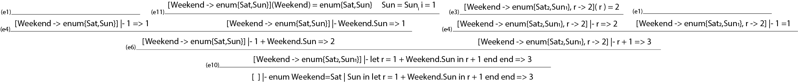

# 1 Regulære udtryk og automater


1)


2)

3)

4)

5)


# Icon

```fsharp
let iconEx1 = Every(Write(Or(FromTo(1, 2), FromTo(3,4))))
> run iconEx1;;
1 2 3 4 val it : value = Int 0
```

1) Omskriv eksemplet iconEx1, så værdierne 3 4 3 4 udskrives på skærmen

```fsharp
let opg1 = Every(Write(And(FromTo(1, 2), FromTo(3,4))))
> run opg1;;
3 4 3 4 val it : value = Int 0
```

2) Skriv et Icon udtryk, som udskriver værdierne "I" "c" "o" "n" på skærmen

```fsharp
let opg2 = Every(Write(Or(Or(Or(CstS "I",CstS "c"),CstS "o"), CstS "n")))
> run opg2;
I c o n val it : value = Int 0
```

3) Udvid implementationen af Icon med en ny generator Bang(str)
```fsharp
let rec eval (e : expr) (cont : cont) (econt : econt) = 
    match e with
    | ...
    | Bang s -> 
      let rec loop (i:string) =
        if i.Length > 0 then
          cont (Str (i.Substring(0, 1))) (fun () -> loop (i.Substring 1))
        else 
          econt ()
      loop s
```
```fsharp
> run (Every(Write(Bang "Icon")));;
I c o n val it : value = Int 0
````

4) Udvid implementationen af Icon med en ny generator BangN(str,n), som fungerer som Bang(str) ovenfor med den udvidelse at strengen str gentages n gange. Generatoren Bang(str) giver identisk uddatasomBangN(str, 1).

```fsharp
let rec eval (e : expr) (cont : cont) (econt : econt) = 
    match e with
    | ...
    | BangN(str,n) ->
      eval (FromTo(1,n)) (fun a -> fun b -> eval (Bang str) cont b) econt
```

```fsharp
> run (Every(Write(BangN("Icon",0))));;
val it : value = Int 0

> run (Every(Write(BangN("Icon",1))));;
I c o n val it : value = Int 0

> run (Every(Write(BangN("Icon",2))));;
I c o n I c o n val it : value = Int 0

> run (Every(Write(BangN("Icon",3))));;
I c o n I c o n I c o n val it : value = Int 0
```

# 3 Enums i micro-ML

1) 



2) Udvid typen expr med ovenstående. Lav også den abstrakte syntaks for udtrykket fra opgave 1 ovenfor:

```fsharp
type expr =
...
| Enum of string * string list * expr
| EnumVal of string * string
```
```fsharp
// Exemple:
enum Weekend = Sat | Sun in Weekend.Sat end
Enum ("Weekend",["Sat"; "Sun"],EnumVal ("Weekend","Sat"))

// Svar:
enum Weekend = Sat | Sun in let r = 1 + Weekend.Sun in r + 1 end end
Enum ("Weekend",["Sat";"Sun"], Let("r", Prim("+", CstI 1, EnumVal ("Weekend", "Sat")), Prim("+",Var "r", CstI 1)))
```

3) Udvid lexer og parser, således at enumerations er understøttet med syntaksen enum

```fsharp
EnumList:
    /* empty */                         { [] }
  | EnumElement                         { $1 }
;

EnumElement:
    NAME                                { [$1]     }
  | NAME PIPE EnumElement               { $1 :: $3 }
;

Expr:
  | ...
  | NAME DOT NAME                       { EnumVal($1, $3)    }

AtExpr:
  | ...
  | ENUM NAME EQ EnumList IN Expr END   { Enum($2, $4, $6)   }
```

```fsharp
//Test af svar fra opgave 2
> let test = fromString "enum Weekend = Sat | Sun in let r = 1 + Weekend.Sun in r + 1 end end";;
val test : Absyn.expr =
  Enum
    ("Weekend",["Sat"; "Sun"],
     Let
       ("r",Prim ("+",CstI 1,EnumVal ("Weekend","Sun")),
        Prim ("+",Var "r",CstI 1)))
```
```fsharp
// de 3 eksempler:
> let e1 = fromString "enum OneTwo = One | Two in OneTwo.One end";;
val e1 : Absyn.expr = Enum ("OneTwo",["One"; "Two"],EnumVal ("OneTwo","One"))
// Alt er som forventet... og sådan er det... Mit liv er for kort til dumme spørgsmål.

> let e1 = fromString "enum One = One in One.One end";;
val e1 : Absyn.expr = Enum ("One",["One"],EnumVal ("One","One"))
// Her har man bare om en enum med en værdi.

> let e1 = fromString "enum None = in 42 end";;
val e1 : Absyn.expr = Enum ("None",[],CstI 42) 
// Denne giver ikke mening, fordi "intet in 42" giver ingen mening.
```

4) Udvid funktionen eval i HigherFun.fs, med evaluering af enumerations.

```fsharp
type value =
| ...
| EVal of string * string list (* Exam *)
````
```fsharp
let rec eval (e : expr) (env : value env) : value =
  match e with
  | ...
  | Enum(s, l, e) ->
      let letEnv = (s,EVal(s,l)) :: env 
      eval e letEnv
  | EnumVal(s1,s2) ->
    match lookup env s1 with
    | EVal(_,l) -> 
      match List.tryFindIndex (fun a -> a = s2 ) l with
      | Some s  -> Int s
      | None    -> failwith "value not part of enum"
    | _         -> failwith "its not a enum"
  | ...
```
```fsharp
//test eksemple fra opgaven skal give 0:
> run (Enum ("Weekend",["Sat"; "Sun"],EnumVal ("Weekend","Sat")));;
val it : value = Int 0
````

# 4 Micro-C Genereret Bytekode

1) Tegn og beskriv indholdet af stakken når programafviklingen når til det sted, hvor kommentaren er indsat i funktionen f. Du skal opdele stakken i stack frames og angive base pointer og stack pointer.

```C
//fra opgaven:
void main() {
    int i;
    i = 3;
    print f(i);
}
int f(int n) {
    int i;
    i = 42;
    /* Describe stack content at this point. */ 
    return n+i;
}
```

```
//the stacktrace
[ ]{0: LDARGS}
[ ]{1: CALL 0 5}
[ 4 -999 ]{5: INCSP 1}
[ 4 -999 0 ]{7: GETBP}
[ 4 -999 0 2 ]{8: CSTI 3}
[ 4 -999 0 2 3 ]{10: STI}
[ 4 -999 3 3 ]{11: INCSP -1}
[ 4 -999 3 ]{13: GETBP}
[ 4 -999 3 2 ]{14: LDI}
[ 4 -999 3 3 ]{15: CALL 1 21}
[ 4 -999 3 18 2 3 ]{21: INCSP 1}
[ 4 -999 3 18 2 3 0 ]{23: GETBP}
[ 4 -999 3 18 2 3 0 5 ]{24: CSTI 1}
[ 4 -999 3 18 2 3 0 5 1 ]{26: ADD}
[ 4 -999 3 18 2 3 0 6 ]{27: CSTI 42}
[ 4 -999 3 18 2 3 0 6 42 ]{29: STI}
[ 4 -999 3 18 2 3 42 42 ]{30: INCSP -1}
[ 4 -999 3 18 2 3 42 ]{32: GETBP}       <--- Here
[ 4 -999 3 18 2 3 42 5 ]{33: LDI}
[ 4 -999 3 18 2 3 42 3 ]{34: GETBP}
[ 4 -999 3 18 2 3 42 3 5 ]{35: CSTI 1}
[ 4 -999 3 18 2 3 42 3 5 1 ]{37: ADD}
[ 4 -999 3 18 2 3 42 3 6 ]{38: LDI}
[ 4 -999 3 18 2 3 42 3 42 ]{39: ADD}
[ 4 -999 3 18 2 3 42 45 ]{40: RET 2}
[ 4 -999 3 45 ]{18: PRINTI}
45 [ 4 -999 3 45 ]{19: RET 1}
[ 45 ]{4: STOP}
```

```
Stack:
[ 4 -999 3 | 18 2 3 42 ]
 stackframe^    bp^  ^sp
````

2) Tilføje tilsvarende kommentarer til `<noget fra opgaven>` de resterende instruktioner.

#####Glem det.

3) < kig i opgaven >

```c
// fra opgaven.
void main() {
    print f(100000);
}
int f(int n) {
    int r;
    r = 0;
    while (n > 0) {
        r = r + (42*2-34*2+32+3);
        n = n-1;
    }
    return r;
}
```


Den her opgave kan helt sikkert laves bedre.
Fx kan man lave en motode der ligner 'addCST'

```fsharp
let rec reducePrim2 e = (* Exam *)
  let e' =
    match e with 
    | Prim2(ope,e1,e2) ->
      let e1' = reducePrim2 e1
      let e2' = reducePrim2 e2
      match (ope,e1',e2') with
      | ("*", CstI e1'', CstI e2'') -> CstI(e1'' * e2'')
      | ("+", CstI e1'', CstI e2'') -> CstI(e1'' + e2'')
      | ("-", CstI e1'', CstI e2'') -> CstI(e1'' - e2'')
      | ("/", CstI e1'', CstI e2'') -> CstI(e1'' / e2'')
      | _                           -> failwith "fuck you"
    | e -> e
  if e <> e' then printfn "ReducePrim2: Expression %A reduced to %A" e e'
  e'
```


```fsharp
> java Machine microcEx1Old.out
5100000
Ran 0.065 seconds

> java Machine microcEx1.out
5100000
Ran 0.05 seconds
```

`1-50/65 = 23% increase`
