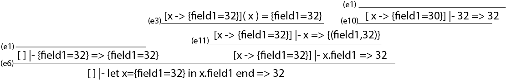

# 1 Icon

```fsharp
let iconEx1 = Write(Prim("<",CstI 7,FromTo(1,10)))
> run iconEx1;;
8 val it : value = Int 8
```

1) Omskriv eksemplet iconEx1, så værdierne 8 9 10 udskrives på skærmen
```fsharp
let iconEx1 = Every(Write(Prim("<",CstI 7,FromTo(1,10))))
> run iconEx1;;
8 9 10 val it : value = Int 0
````

2) 
```fsharp
//Old
let iconEx2 = Every(Write(And(FromTo(1,4), And(Write (CstS "\n"),FromTo(1,4)))))
> run iconEx2;;
1 2 3 4
1 2 3 4
1 2 3 4
1 2 3 4 val it : value = Int 0

//new
let iconEx2 = Every(Write(Prim("*",FromTo(1,4), And(Write (CstS "\n"),FromTo(1,4)))))
> run iconEx2;;
 1 2 3 4
 2 4 6 8
 3 6 9 12
 4 8 12 16 val it : value = Int 0

Det kan formelt skrives: every ( write ( (1 to 4) * ( (write "\n") + ( 1 to 4))))
```

3) Udvid implementationen af Icon med en ny generator Find(pat,str)
```fsharp
//Fra Eliases svar <3 
| Find(pat,str) ->
  let rec findIndex (i:int) =
    let index = str.IndexOf(pat,i) 
    if index <> -1
    then
      cont (Int index) (fun () -> findIndex (index+1))
    else
      econt ()
  findIndex 0   
```

4) Lav 3 relevante testeksempler af Find ovenfor, og vis resultatet af at evaluere dem.
```fsharp
> run (Every(Write(Find(" ",str))));;
2 8 10 13 19 23 val it : value = Int 0

> run (Every(Write(Find("p",str))));;
val it : value = Int 0

> run (Every(Write(Find("e","hej"))));;
1 val it : value = Int 0

> run (Every(Write(Find("e",""))));;
val it : value = Int 0
````

5) Skriv, og evaluer, et Icon udtryk, som udskriver indekser på alle tegn "e"
```fsharp
> let str = "Hi there - if there are anyone";;

> run (Every(Write(Find("e",str))));;
5 7 16 18 22 29 val it : value = Int 0

> run (Every(Write(Prim("<",CstI 10,Find("e",str)))));;
16 18 22 29 val it : value = Int 0
```

# 2 Parsing Records i micro–ML

1) Angiv den abstrakte syntaks
```fsharp
let x = { } in x end (* ex1 *)
Let ("x",Record [],Var "x")

let x = {field1 = 32} in x.field1 end (* ex2 *)
Let ("x",Record [("field1", CstI 32)],Field (Var "x","field1"))

let x = {field1 = 32; field2 = 33} in x end (* ex3 *)
Let ("x",Record [("field1", CstI 32);("field2", CstI 33)],Var "x")

let x = {field1 = 32; field2 = 33} in x.field1 end (* ex4 *)
Let ("x",Record [("field1", CstI 32);("field2", CstI 33)],Field (Var "x","field1"))

let x = {field1 = 32; field2 = 33} in x.field1+x.field2 end (* ex5 *)
Let ("x",Record [("field1", CstI 32);("field2", CstI 33)],Prim("+",Field (Var "x","field1"),Field (Var "x","field1")))
```

2) Udvid lexer (FunLex.fsl) og parser (FunPar.fsy), således at records er understøttet med gram-
matikken vist ovenfor.

```fsharp
type expr = 
  ...
  | Field of expr * string
  | Record of (string * expr) list
```

```fsharp
rule Token = parse
  ...
  | '.'             { DOT }
  | ';'             { SEMI }
  | '{'             { LCBRACK }
  | '}'             { RCBRACK }
```

```fsharp

%token DOT SEMI
%token LCBRACK RCBRACK

RecordList:
    NAME EQ Expr                        { [($1, $3)]    }
  | NAME EQ Expr SEMI RecordList        { ($1, $3)::$5  }

AtExpr:
  ...
  | LET NAME EQ LCBRACK RCBRACK IN Expr END             { Let($2, Record([]), $7) }
  | LET NAME EQ LCBRACK RecordList RCBRACK IN Expr END  { Let($2, Record($5), $8) }

Expr:
  ...
  | Expr DOT NAME     { Field($1, $3) }
```

Examples
```fsharp
> let ex1 = fromString("let x = { } in x end");;
val ex1 : Absyn.expr = Let ("x",Record [],Var "x")

> let ex2 = fromString("let x = {field1 = 32} in x.field1 end");;
val ex2 : Absyn.expr = Let ("x",Record [("field1", CstI 32)],Field (Var "x","field1"))

> let ex3 = fromString("let x = {field1 = 32; field2 = 33} in x end");;
val ex3 : Absyn.expr = Let ("x",Record [("field1", CstI 32); ("field2", CstI 33)],Var "x")

> let ex4 = fromString("let x = {field1 = 32; field2 = 33} in x.field1 end");;
val ex4 : Absyn.expr =
  Let
    ("x",Record [("field1", CstI 32); ("field2", CstI 33)],
     Field (Var "x","field1"))

> let ex5 = fromString("let x = {field1 = 32; field2 = 33} in x.field1+x.field2 end");;
val ex5 : Absyn.expr =
  Let
    ("x",Record [("field1", CstI 32); ("field2", CstI 33)],
     Prim ("+",Field (Var "x","field1"),Field (Var "x","field2")))
```

# 3 Evaluering af Records i micro–ML

1) Tegn et evaluerings træ



2) Udvid funktionen eval i HigherFun.fs
```fsharp
type value =
  | Int of int
  | RecordV of (string * value) list
  | Closure of string * string * expr * value env

let rec eval (e : expr) (env : value env) : value =
  match e with
  | ...
  | Record l -> RecordV(List.map (fun (a,b) -> (a,eval b env) ) l)
  | Field(e,s) -> 
    let v = eval e env
    match v with
    | RecordV l -> lookup l s 
    | _ -> failwith "Not a record"
  | ...    
```

3) Lav mindst 5 eksempler med records, hvor du bl.a. tester din beslutning om sammenfaldne feltnavne. Vis resultatet af at køre eksemplerne og forklar hvorvidt resultatet er som forventet.
```fsharp
> run (Let ("x",Record [("field1", CstI 32);("field1",CstI 33)],Field (Var "x","field1")));;
val it : HigherFun.value = Int 32

//og så lidt flere her.
```

# 4 Breakpoints i micro–C  


```fsharp
//absyn
and stmt =
  |...
  | Break of expr
```
```fsharp
//CLex
let keyword s =
    match s with
    | ...
    | "break"   -> BREAK    
```

```fsharp
//CPar.fsy
%token BREAK

StmtM:
  | ...
  | BREAK Expr SEMI         { Break($2) }
```

```fsharp
//Contcomp.c
let rec cStmt stmt (varEnv : varEnv) (funEnv : funEnv) (C : instr list) : instr list = 
    match stmt with
    | ...
    | Break e ->
      let (labSkip, C1) = addLabel C
      cExpr e varEnv funEnv (BREAK :: IFZERO labSkip :: WAITKEYPRESS :: C1)
```

```fsharp
//Machine.fs
type instr =
  | ...
  | BREAK   
  | WAITKEYPRESS

let CODEBREAK  = 26
let CODEWAITKEYPRESS = 27;

let makelabenv (addr, labenv) instr = 
    | ...
    | BREAK          -> (addr+1, labenv)
    | WAITKEYPRESS   -> (addr+1, labenv)

let rec emitints getlab instr ints = 
    match instr with
    | ...
    | BREAK          -> CODEBREAK  :: ints
    | WAITKEYPRESS   -> CODEWAITKEYPRESS :: ints
```

```fsharp 
//Machine.java
  final static int 
    ...
    BREAK = 26, WAITKEYPRESS = 27;

  static int execcode(int[] p, int[] s, int[] iargs, boolean trace) {
    ...
      switch (p[pc++]) {
      case BREAK:
        printsppc(s, bp, sp, p, pc);
        break;
      case WAITKEYPRESS:
        try {
          System.out.println("Please press ENTER");
          System.in.read();
        } catch (Exception e) {
          System.out.println("Jesus loves you");
        }
        break;
      case CSTI:
        ...

  static String insname(int[] p, int pc) {
    switch (p[pc]) {
    ...
    case BREAK:  return "BREAK";
    case WAITKEYPRESS: return "WAITKEYPRESS";
```

```fsharp
//test
> java Machine bp.out 8                                                                                                                                         13:17:45 
8 [ 4 -999 8 1 ]{19: IFZERO 22}
please press key

7 [ 4 -999 7 0 ]{19: IFZERO 22}
6 [ 4 -999 6 1 ]{19: IFZERO 22}
please press key

5 [ 4 -999 5 0 ]{19: IFZERO 22}
4 [ 4 -999 4 1 ]{19: IFZERO 22}
please press key

3 [ 4 -999 3 0 ]{19: IFZERO 22}
2 [ 4 -999 2 1 ]{19: IFZERO 22}
please press key

1 [ 4 -999 1 0 ]{19: IFZERO 22}


Ran 3.201 seconds
```


# 5 Arrays i micro–C


1) Tegn og beskriv indholdet af stakken når programafviklingen når til det sted, hvor kommentaren er indsat i funktionen printArray. Du skal opdele stakken stack frames og angive base pointer og stack pointer.
```
//The stackframe 
[ 4 -999 42 42 42 42 42 2 5 | 125 2 2 0 ]
             stackframeskift^     | sp^
                                bp^  
```

2) Forklar, hvorfor vi, efter at have fjernet `print 43;` giver `2 1 4 3 1`.
```
Resultatet bliver ikke som forventet, da "optimeringerne" i Contcomp.fs gør at `printArray(a)` bliver lavet til et TCall (et tail call), som overskriver den gamle stackframe, hvilket resulterer i at 42'tallerne bliver overskrevet.
```
